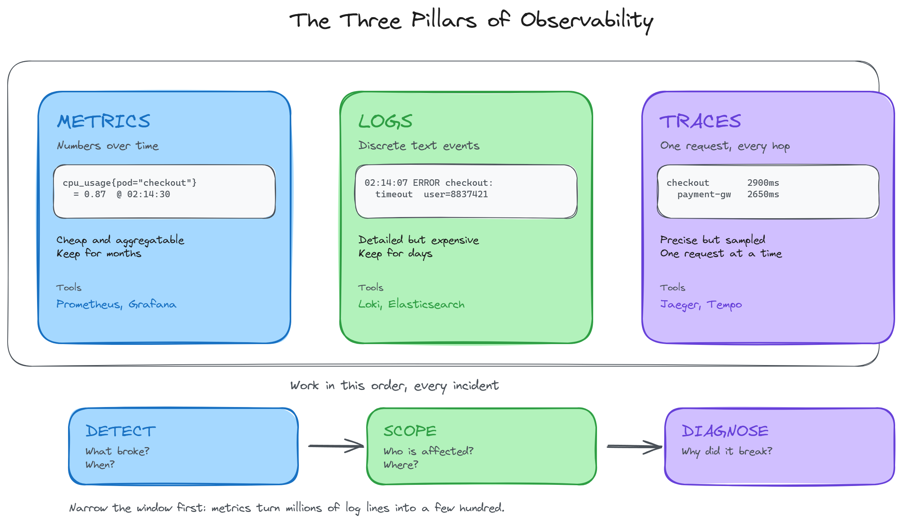

# Section 1: What is Observability?

**Module:** 01 - Introduction to Observability: Prometheus and Grafana Setup
**Duration:** approximately 7 minutes
**Hands-on:** None. This is a concept section.
**Prerequisites:** None

---

## Table of Contents

- [The 2 AM Problem](#the-2-am-problem)
- [Monitoring vs Observability](#monitoring-vs-observability)
- [The Three Pillars](#the-three-pillars)
- [Analogy: Hotstar on IPL Final Night](#analogy-hotstar-on-ipl-final-night)
- [Which Pillar Answers Which Question](#which-pillar-answers-which-question)
- [Where This Course Sits](#where-this-course-sits)
- [Key Takeaways](#key-takeaways)
- [Interview Questions](#interview-questions)
- [What's Next](#whats-next)

---

## The 2 AM Problem

Your phone buzzes at 2 AM. Checkout is failing. Customers are dropping.

You have three questions, and you have them in this order:

1. What is broken?
2. When did it start?
3. Why did it break?

Everything in this course exists to answer those three questions faster than you could by guessing.

Notice the order. Most engineers under pressure jump straight to *why* - they connect to a machine and start reading logs. That is the slowest possible path. You cannot read logs usefully until you know which component and which time window to read. Answering *what* and *when* first reduces a haystack of millions of log lines to a few hundred.

---

## Monitoring vs Observability

These two terms get used interchangeably. They are not the same thing, and the difference appears in interviews constantly.

**Monitoring** answers questions you decided to ask in advance.

You built a dashboard. It has a CPU graph, a memory graph, and a request rate graph. When CPU crosses 80 percent, you get paged. That is monitoring: a fixed set of predefined questions, asked continuously.

**Observability** is the property of a system that lets you ask questions you did not anticipate.

At 2 AM you want to ask: which pods, in which namespace, on which node, started climbing at exactly the same moment as the checkout latency spike?

Nobody built a dashboard for that. Nobody could have, because you did not know you would need it until 30 seconds ago. If you can answer it without shipping new code, your system is observable. If you have to add a log line and redeploy to find out, it is not.

The practical test: have you ever added a print statement or a log line to production purely to debug something?

If yes, that is the gap. You had to change the system in order to ask it a question. Observability means the data was already being collected before you knew you needed it.

Monitoring is a subset of observability. You need both. Monitoring tells you something is wrong. Observability tells you what to do about it.

---

## The Three Pillars

Observability rests on three types of telemetry data.



### Metrics

Numbers over time. A measurement, a timestamp, and a set of labels.

```
cpu_usage{pod="checkout-7d9f", namespace="prod"} = 0.87    @ 02:14:30
http_requests_total{status="500", service="checkout"} = 1247  @ 02:14:30
```

Metrics are cheap. A number is a few bytes. You can retain them at high resolution for months and query years of history in milliseconds. This is why metrics are the foundation: they are the only pillar you can afford to collect for everything, all the time.

Metrics are also aggregatable. "Average latency across all pods in this deployment" is a single fast query. That is what makes them good at answering *what* and *when*.

What metrics cannot do is tell you about one specific user. A metric has already discarded the individual events in order to produce a number.

Tools: Prometheus, Grafana, Thanos, VictoriaMetrics

### Logs

Discrete text events. One line per thing that happened.

```
2026-02-14 02:14:07 ERROR checkout: payment gateway timeout, user=8837421, order=A-99213
```

Logs carry the detail that metrics discarded: the user ID, the order number, the stack trace. When you need to know exactly what happened to one specific request, logs have it.

The cost is volume. A busy service produces gigabytes per hour. You cannot retain logs for the same duration as metrics, and searching them across a wide time range is slow and expensive. This is precisely why you narrow the window with metrics first.

Tools: Loki, Elasticsearch (ELK), OpenSearch, CloudWatch Logs

### Traces

The journey of one request across services.

In a monolith, a slow request is a slow function, and the stack trace tells you where. In microservices, a single checkout call might touch twelve services. The user experiences 3 seconds of delay. Which of the twelve caused it?

A trace follows one request end to end and records how long each hop took:

```
checkout-api        [==============================]   2900 ms
  auth-service      [=]                                   40 ms
  inventory-svc     [==]                                  85 ms
  payment-gateway   [===========================]       2650 ms   <-- root cause
  notification      [=]                                   35 ms
```

Metrics told you checkout is slow. The trace tells you it is the payment gateway, not your code.

Tools: Jaeger, Tempo, Zipkin, AWS X-Ray

---

## Analogy: Hotstar on IPL Final Night

Four crore people are streaming the final at the same time. You are on the operations floor.

**Metrics are the wall dashboard.**

Concurrent viewers: 4.1 crore. Buffering ratio: 0.3 percent. CDN egress: 12 Tbps. Average startup time: 1.8 seconds.

Large numbers, refreshed every few seconds, on screen whether or not anything is wrong. At 21:14 the buffering ratio jumps from 0.3 percent to 4 percent. You now know what broke and when.

**Logs are the raw event stream.**

Millions of lines scrolling past:

```
21:14:07  user 8837421  bitrate drop 1080p to 480p   edge=mum-3
21:14:07  user 9921044  rebuffer event 2.1s          edge=mum-3
21:14:08  user 4410982  bitrate drop 1080p to 480p   edge=mum-3
```

You filter to 21:14 and the pattern appears: they are all hitting the same CDN edge, mum-3. Now you know who is affected and where.

**Traces follow one viewer.**

You pick a single affected user and follow their play request through every hop:

```
phone -> CDN edge (mum-3) -> auth service -> DRM licence server -> manifest service
 12 ms       35 ms              18 ms            900 ms               22 ms
```

The DRM licence server is adding 900 milliseconds. That is why.

Three tools, three questions, one incident. The dashboard found the spike. The logs found the blast radius. The trace found the root cause.

The order is not optional. If you start with traces, you are picking one request out of four crore at random and hoping it happens to be a bad one.

---

## Which Pillar Answers Which Question

| Question | Pillar | Why | Covered here |
|---|---|---|---|
| What is broken? | Metrics | Aggregated numbers show which component deviated | Yes |
| When did it start? | Metrics | Time series preserve history, so you can scroll back | Yes |
| Who is affected? | Logs | Individual events retain user and request identity | No. Loki or ELK |
| Why did it break? | Traces | Per-hop timing isolates the failing dependency | No. Jaeger or Tempo |

---

## Where This Course Sits

This course covers metrics: Prometheus for collection and storage, Grafana for visualisation.

This is deliberate, and it is the correct place to start.

- Metrics are the entry point to every incident. You reach for them first, every time.
- They are the cheapest pillar to operate, which is why most teams begin there in the real world.
- Prometheus is the de facto standard on Kubernetes. Kubernetes components expose Prometheus format metrics natively, with no adapter required.
- The concepts transfer. Once you understand scraping, labels, and time series, Loki and Tempo are the same mental model applied to different data.

Be precise about this in interviews. "We installed Prometheus" is not the same claim as "we have observability." One pillar is a strong foundation, not a complete story.

---

## Key Takeaways

- Monitoring answers predefined questions. Observability lets you ask new ones without redeploying.
- The three pillars are metrics, logs, and traces. They are sequential, not interchangeable.
- Work in order: metrics to detect, logs to scope, traces to diagnose.
- Metrics are cheap and aggregatable. Logs are detailed and expensive. Traces are narrow and precise.
- This course covers the metrics pillar using Prometheus and Grafana.

---

## Interview Questions

**1. What is the difference between monitoring and observability?**

Monitoring is the practice of collecting and alerting on a predefined set of signals. You decide the questions in advance and build dashboards for them. Observability is a property of the system: whether its telemetry is rich enough to answer questions you did not anticipate, without deploying new code. Monitoring is a subset of observability.

**2. Name the three pillars and one tool for each.**

Metrics (Prometheus), logs (Loki or Elasticsearch), traces (Jaeger or Tempo).

**3. A service is reported slow. Which pillar do you reach for first, and why?**

Metrics. They confirm the problem is real, identify which component deviated, and pin down the time window. Without that window, log and trace searches are unbounded: slow, expensive, and likely to surface noise rather than signal.

**4. Can you achieve full observability with metrics alone?**

No. Metrics detect and localise, but they discard per-request detail during aggregation, so they cannot explain root cause. They are necessary but not sufficient.

**5. Why are metrics cheaper to retain than logs?**

A metric sample is a number, a timestamp, and a label set. That is a handful of bytes, and it compresses well because consecutive samples are similar. A log line is unbounded text with high variability. For the same time window, logs are typically orders of magnitude larger.

**6. What does high cardinality mean, and why does it matter for metrics?**

Cardinality is the number of unique label combinations for a metric. Adding a label such as user_id creates one time series per user, which can be millions. Prometheus holds a series index in memory, so unbounded cardinality is the most common cause of a Prometheus instance running out of memory. Identity belongs in logs, not in metric labels.

---

## What's Next

Prometheus does not sit and wait for your applications to send it data.

It goes out and collects it, on a schedule, over HTTP, from every target it knows about. That single design decision explains most of how Prometheus behaves, including behaviour that looks strange at first, such as why a dead pod's metrics simply stop rather than reporting zero.

[Section 2: Prometheus Architecture](./02-prometheus-architecture.md)
