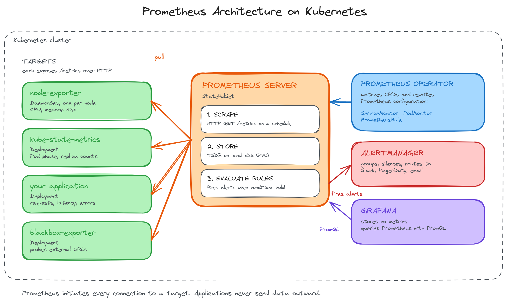
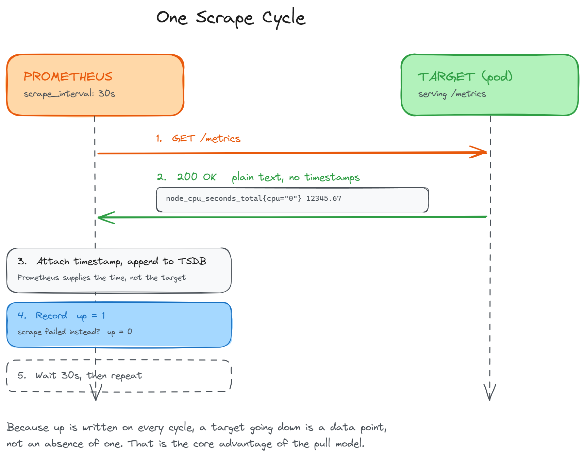

# Section 2: Prometheus Architecture

**Module:** 01 - Introduction to Observability: Prometheus and Grafana Setup
**Duration:** approximately 15 minutes
**Hands-on:** None. This is a concept section.
**Prerequisites:** Section 1

---

## Table of Contents

- [Push vs Pull](#push-vs-pull)
- [Analogy: The Telecom Network Operations Centre](#analogy-the-telecom-network-operations-centre)
- [Why Pull Wins on Kubernetes](#why-pull-wins-on-kubernetes)
- [Core Components](#core-components)
- [How Scraping Works](#how-scraping-works)
- [What a Metrics Endpoint Looks Like](#what-a-metrics-endpoint-looks-like)
- [Key Concept: Time Series](#key-concept-time-series)
- [Key Concept: Labels](#key-concept-labels)
- [Key Concept: PromQL](#key-concept-promql)
- [Troubleshooting](#troubleshooting)
- [Key Takeaways](#key-takeaways)
- [Interview Questions](#interview-questions)
- [What's Next](#whats-next)

---

## Push vs Pull

Most monitoring systems you have used are push-based. The application holds a metrics library, and every few seconds it sends data outward to a collector. StatsD, Graphite, and most SaaS agents work this way.

Prometheus inverts that. Your application does nothing but expose a plain HTTP endpoint, usually at `/metrics`, that returns its current numbers as text. It never initiates a connection. Prometheus reaches out on a schedule and collects them.

```
PUSH MODEL
  app-1  ---> 
  app-2  --->   collector      apps decide when to send
  app-3  --->

PULL MODEL
  app-1  <---
  app-2  <---   Prometheus     Prometheus decides when to collect
  app-3  <---
```

This looks like a small implementation detail. It is not. It is the single decision that explains most of Prometheus's behaviour, including the parts that surprise people later.

---

## Analogy: The Telecom Network Operations Centre

A mobile operator runs thousands of cell towers. The network operations centre needs to know the state of every one of them.

**In a push design,** every tower reports in when it feels like it. The NOC receives a flood of incoming messages from thousands of sources. Two problems appear immediately.

First, when a tower stops reporting, what does the silence mean? Did the tower fail? Did the network path fail? Is the tower fine but its reporting process crashed? Silence is ambiguous, and ambiguity at 2 AM is expensive.

Second, the NOC has no control over load. If every tower reports at once during an incident, the collector is overwhelmed exactly when it is needed most.

**In a pull design,** each tower keeps a live status page. It updates it continuously and does nothing else. The NOC polls each tower on a fixed schedule.

Now silence is not ambiguous. If the NOC polls a tower and the poll fails, that failure is itself a recorded fact: this tower did not answer at 09:14:30. It is a data point, not an absence of one.

And the NOC controls its own load. It decides the polling interval, the timeout, and the order. A surge of incidents does not change how much work the NOC has to do.

Prometheus is the NOC. Your pods are the towers.

---

## Why Pull Wins on Kubernetes

The analogy maps onto four concrete properties.

**Failure is a signal, not silence.** Every successful scrape writes a synthetic metric called `up` with a value of 1. Every failed scrape writes `up` with a value of 0. So "this target is down" is a normal time series you can graph, query, and alert on, exactly like CPU or memory. In a push system you have to infer failure from missing data, which is much harder to reason about.

**Prometheus controls its own load.** The scrape interval is set by Prometheus, not by the applications. A thousand pods cannot accidentally flood it.

**Targets are discovered, not configured.** Pods on Kubernetes are created and destroyed constantly, with unpredictable names and IP addresses. In a push model, every new pod would need to know the collector's address. In a pull model, Prometheus queries the Kubernetes API, discovers what exists right now, and scrapes it. A pod that appears at 10:00 is being scraped by 10:00:30 without anyone configuring anything.

**Applications stay simple.** An application exposing metrics needs no queue, no retry logic, no backpressure handling, and no knowledge of where Prometheus lives. It answers an HTTP request. That is the entire integration.

There is a genuine trade-off, and it is worth stating honestly. Pull requires network reachability from Prometheus to every target. Short-lived batch jobs may finish before any scrape happens, and targets behind a firewall or NAT cannot be reached. Prometheus solves the batch job case with a separate component called Pushgateway, which those jobs push to and Prometheus then scrapes. It is a deliberate exception, not the normal path.

---

## Core Components



### Prometheus Server

The server does three jobs, and it helps to keep them separate in your head.

**It scrapes.** On a schedule, it issues HTTP GET requests to the `/metrics` endpoint of every target it knows about.

**It stores.** Samples go into a built-in time series database, the TSDB, written to local disk. Prometheus is not a general-purpose database and does not replicate by default. This matters later when you think about retention and high availability.

**It evaluates rules.** On a separate schedule, it runs alerting rules against the stored data. When a rule's condition holds true for long enough, Prometheus fires an alert to Alertmanager. Prometheus decides *whether* to alert. It does not decide *who to tell*.

### Exporters

Most systems do not expose Prometheus-format metrics natively. An exporter is a small process that sits beside such a system, reads its state, and republishes it as a `/metrics` endpoint.

| Exporter | What it exposes |
|---|---|
| node-exporter | Host level metrics: CPU, memory, disk, filesystem, network |
| kube-state-metrics | Kubernetes object state: pod phase, deployment replicas, job status |
| blackbox-exporter | Probe results for external endpoints over HTTP, TCP, ICMP, DNS |

The distinction between node-exporter and kube-state-metrics catches people out, and it is a common interview question.

node-exporter reports on the **machine**. It runs as a DaemonSet, one pod per node, and answers "how much memory is this node using?"

kube-state-metrics reports on the **Kubernetes API objects**. It runs as a single deployment and answers "how many replicas does this deployment want, and how many does it have?" It reports what the API server believes, not what any machine is doing.

One tells you about the infrastructure. The other tells you about the desired and actual state of your workloads.

### Alertmanager

Prometheus fires alerts. Alertmanager decides what happens to them: grouping related alerts together, suppressing duplicates, silencing during maintenance, and routing to Slack, PagerDuty, email, or a webhook.

Keeping these two separate is deliberate. Prometheus knows about data. Alertmanager knows about people and schedules. Section 8 covers this in detail.

### Grafana

Grafana stores no metrics of its own. It connects to Prometheus as a data source, sends PromQL queries, and renders the results. Every number on a Grafana dashboard was fetched from Prometheus at page load time.

---

## How Scraping Works



One scrape cycle, in order:

1. Prometheus consults its list of targets, built from service discovery
2. It issues an HTTP GET to each target's metrics endpoint
3. The target responds with its current values as plain text
4. Prometheus parses the response and attaches a timestamp
5. Samples are appended to the TSDB
6. Prometheus records `up=1` for that target, or `up=0` if the scrape failed

Then it waits for the next interval and does it all again.

```
Prometheus                                node-exporter
    |                                          |
    |  GET /metrics                            |
    |----------------------------------------->|
    |                                          |
    |  200 OK                                  |
    |  node_cpu_seconds_total{...} 12345.67    |
    |  node_memory_MemAvailable_bytes 4.29e+09 |
    |<-----------------------------------------|
    |                                          |
    |  append to TSDB with timestamp           |
    |  record up{instance="..."} = 1           |
    |                                          |
    |  ... wait for scrape_interval ...        |
```

The default scrape interval is 15 seconds. In this course we set 30 seconds, which is a common production choice: it halves storage and load while remaining fast enough for most alerting.

An important consequence of this design is that **Prometheus only knows what it saw at scrape time**. If a value spikes and returns to normal between two scrapes, Prometheus never sees the spike. Metrics are samples, not a complete record. This is a real limitation, and it is why you do not use metrics to audit individual events.

---

## What a Metrics Endpoint Looks Like

There is no special protocol here. It is text over HTTP, and you can read it yourself:

```
# HELP node_cpu_seconds_total Seconds the CPUs spent in each mode.
# TYPE node_cpu_seconds_total counter
node_cpu_seconds_total{cpu="0",mode="idle"} 12345.67
node_cpu_seconds_total{cpu="0",mode="user"} 890.12
node_cpu_seconds_total{cpu="1",mode="idle"} 12401.03

# HELP node_memory_MemAvailable_bytes Available memory in bytes.
# TYPE node_memory_MemAvailable_bytes gauge
node_memory_MemAvailable_bytes 4294967296
```

Three things to notice.

`# HELP` and `# TYPE` are metadata. They describe what the metric means and what kind of metric it is.

Notice there are no timestamps in the response. The target does not know or care what time it is. Prometheus attaches the timestamp when it records the sample, which means all samples from one scrape share a consistent time.

The two `TYPE` values shown here behave differently. A **counter** only ever increases, resetting to zero when the process restarts. A **gauge** goes up and down freely. `node_cpu_seconds_total` is a counter, so its raw value is meaningless on its own. You care about its rate of change, which is why PromQL queries against counters almost always wrap them in `rate()`.

---

## Key Concept: Time Series

A time series is a metric name, plus a set of labels, plus values recorded over time.

```
node_cpu_seconds_total{instance="node1", mode="idle"}

    12345.67  at 10:00:00
    12346.01  at 10:00:30
    12346.89  at 10:01:00
```

The name and labels together form the identity of the series. The values are what change.

This identity is exact. Change one label value and you have a different series with its own separate history.

---

## Key Concept: Labels

Labels are key-value pairs that let one metric name cover many dimensions.

```
http_requests_total{method="GET",  status="200", service="api"}
http_requests_total{method="POST", status="500", service="api"}
http_requests_total{method="GET",  status="200", service="web"}
```

Same metric name. Three separate time series, because the label sets differ.

This is what makes PromQL powerful. You can filter on any label, aggregate away the ones you do not care about, and group by the ones you do, without having defined those views in advance. Total requests per service, error rate per method, traffic by status code: all from the same underlying data.

It is also the most common way to break a Prometheus installation.

The number of unique label combinations is called **cardinality**, and every combination creates a separate time series that Prometheus indexes in memory. Labels with bounded values are fine: HTTP methods, status codes, and service names have maybe a few dozen possibilities each.

Labels with unbounded values are not. Adding `user_id` to a metric creates one time series per user. Adding `request_id` creates one per request, forever. This is the leading cause of Prometheus running out of memory in production.

The rule: **labels are for dimensions you group by. Identity belongs in logs.**

---

## Key Concept: PromQL

PromQL is the query language for Prometheus. You will use it in Grafana panels, in alerting rules, and in the Prometheus UI when debugging. Section 3 of the course covers it properly; this is enough to read the queries in later sections.

**CPU usage percentage per node**

```
100 - (avg by (instance) (rate(node_cpu_seconds_total{mode="idle"}[5m])) * 100)
```

Read it inside out. `node_cpu_seconds_total{mode="idle"}` selects the idle time counters. `rate(...[5m])` computes per-second increase averaged over a 5 minute window, turning a counter into a rate. `avg by (instance)` collapses the per-CPU-core series into one value per node. Then subtract from 100, because time not spent idle is time spent busy.

**HTTP error rate**

```
rate(http_requests_total{status=~"5.."}[5m])
```

`=~` is a regular expression matcher, so `status=~"5.."` selects every 5xx status code. Wrapped in `rate()`, this gives errors per second rather than a cumulative total.

Two things to carry forward. Counters are almost always wrapped in `rate()` before they are useful. And the `[5m]` is a lookback window, not a filter on time.

---

## Troubleshooting

Problems in this section are conceptual, but these come up as soon as you start looking at real targets in Section 4.

**A target shows as DOWN in the Prometheus UI.**

The scrape failed. `up` is 0 for that target. Common causes: the pod is not running, the metrics port is wrong, the path is not `/metrics`, or a NetworkPolicy is blocking Prometheus. The Prometheus targets page shows the actual error text next to each failed target, which usually names the cause directly.

**A target does not appear at all.**

Different problem. DOWN means Prometheus tried and failed. Missing means Prometheus does not know the target exists, which is a service discovery issue rather than a connectivity one.

**A counter shows a huge negative rate.**

The process restarted, resetting the counter to zero. `rate()` handles resets correctly on its own. If you see this, you are probably using `increase()` or raw subtraction where `rate()` was appropriate.

**A metric exists but every value is zero.**

Check whether the metric is a counter that genuinely has not incremented, or whether you are querying the raw counter where you meant to query its rate.

---

## Key Takeaways

- Prometheus is pull-based. It scrapes targets on a schedule rather than receiving pushed data.
- A failed scrape records `up=0`, so target failure is a queryable time series rather than an absence of data.
- Pull suits Kubernetes because Prometheus discovers targets from the API server as pods come and go.
- The server scrapes, stores in a local TSDB, and evaluates rules. Alertmanager handles routing separately.
- Exporters translate systems that do not speak Prometheus natively. node-exporter covers machines, kube-state-metrics covers Kubernetes objects.
- A metrics endpoint is plain text over HTTP, with no timestamps. Prometheus adds those.
- A time series is a metric name plus labels. Change a label value and it is a different series.
- Cardinality is the main operational risk. Never put unbounded values such as user IDs in labels.

---

## Interview Questions

**1. Is Prometheus push or pull based, and why does it matter?**

Pull. Prometheus scrapes an HTTP endpoint on each target on a schedule. It matters because a failed scrape produces `up=0`, making target failure an explicit data point rather than an inferred absence. It also lets Prometheus control its own load and discover targets dynamically instead of requiring every application to know where the collector is.

**2. What is the `up` metric?**

A synthetic metric Prometheus generates for every scrape: 1 if the scrape succeeded, 0 if it failed. It is not exposed by the target. Most basic availability alerting is built on `up == 0`.

**3. What is the difference between node-exporter and kube-state-metrics?**

node-exporter reports machine level metrics such as CPU, memory, and disk. It runs as a DaemonSet with one pod per node. kube-state-metrics reports the state of Kubernetes API objects, such as deployment replica counts and pod phases. It runs as a single deployment and reflects what the API server believes, not what any machine is doing.

**4. How does Prometheus find targets on Kubernetes?**

Through service discovery. Prometheus queries the Kubernetes API for pods, services, endpoints, and nodes matching its configuration, and updates its target list as objects are created and deleted. With the Prometheus Operator this is expressed through ServiceMonitor and PodMonitor resources rather than raw scrape configuration.

**5. What is the difference between a counter and a gauge?**

A counter only increases and resets to zero when the process restarts, so its raw value carries little meaning and it is normally queried with `rate()`. A gauge moves up and down freely, and its current value is meaningful on its own.

**6. What is cardinality and why is it dangerous?**

Cardinality is the number of unique label combinations for a metric. Each combination is a separate time series held in the in-memory index. Labels with unbounded values, such as user IDs or request IDs, create unbounded series counts and are the most common cause of Prometheus exhausting memory.

**7. Prometheus is pull-based. How do you monitor a batch job that finishes in five seconds?**

Pushgateway. The job pushes its metrics to Pushgateway before exiting, and Prometheus scrapes Pushgateway on its normal schedule. It is a deliberate exception for short-lived jobs, not a general-purpose push endpoint, because metrics pushed there persist until explicitly deleted.

**8. If a value spikes between two scrapes, does Prometheus record it?**

No. Metrics are samples taken at the scrape interval. Anything that rises and falls entirely between two scrapes is invisible. This is why metrics are used for trends and thresholds, not for auditing individual events.

---

## What's Next

That is the architecture. Before deploying it properly on Kubernetes, the next section takes a short detour to show how Prometheus is installed on a plain Linux machine.

It is worth three minutes, because seeing what the package manager gives you makes it obvious what the Kubernetes approach adds and why the operator exists at all.

[Section 3: APT Installation](./03-apt-installation.md)
